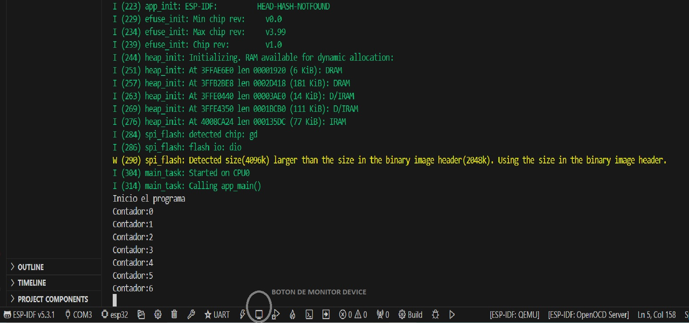

# Curso de programacion del ESP32 mediante ESP-IDF

## 01 - Imprimir en terminal
En este simple ejemplo  programo un contador que imprime su valor en el terminal. Para ver los mensajes utilizo la herramienta `Monitor device` de espressif.

## Monitor device

